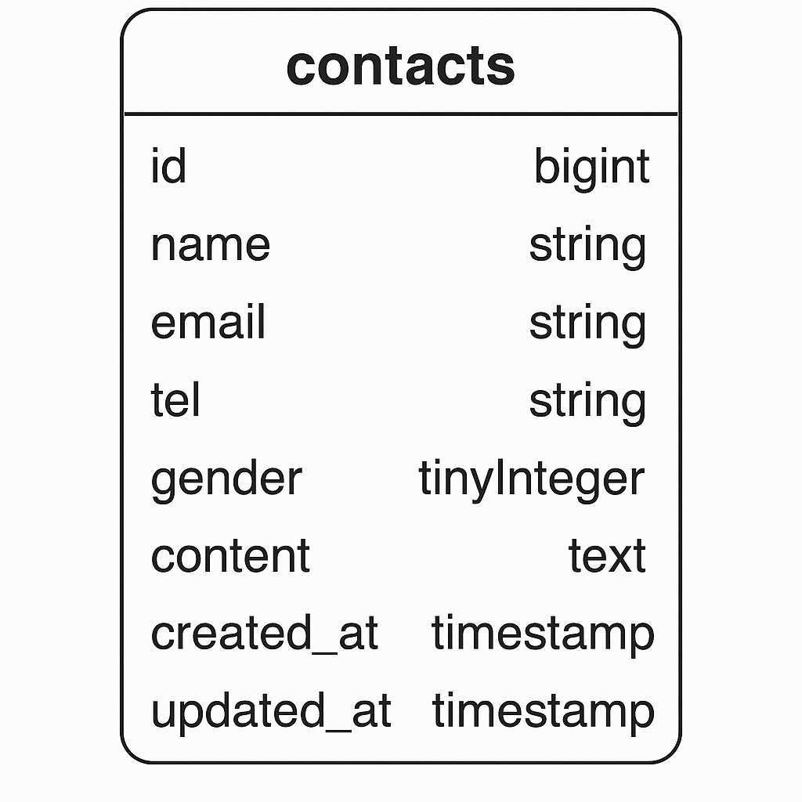

---

## 🌱 機能一覧

- お問い合わせフォーム  
  - 入力 → 確認 → 送信完了画面までの遷移  
  - バリデーション（必須項目・形式チェック）  
- 管理者画面（※実装済みの場合）

---

## 🖼 ER図



---

## 📁 ディレクトリ構成（一部）

```bash
kadai1/
├── app/
├── database/
├── public/
├── resources/
├── routes/
│   └── web.php
├── docker/
│   ├── app/
│   └── mysql/
├── .env
└── README.md

---

## 🌐 ローカル環境アクセス

- http://localhost


